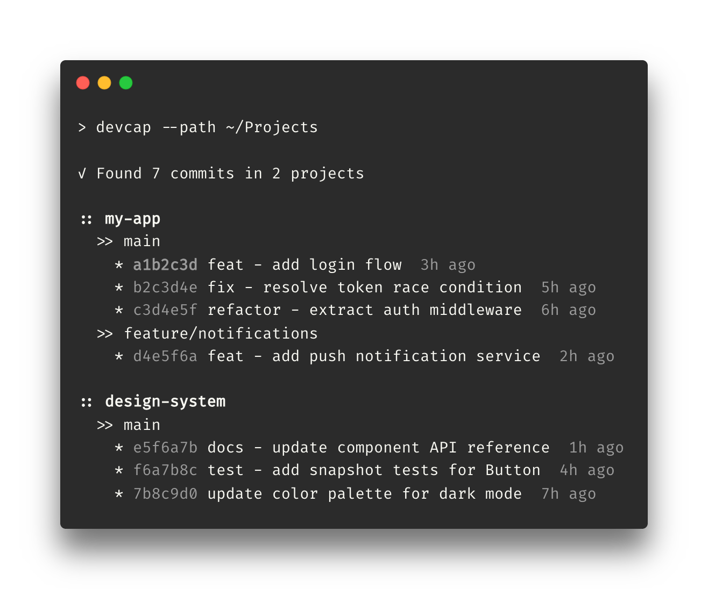

# worklog-git

Aggregate git commits across multiple local repositories for daily stand-ups and time tracking.

Scans a directory tree for git repos in parallel, filters commits by author and time period, and renders a colorized `Project -> Branch -> Commits` tree — or structured JSON.



## ✨ Features

- **Flexible time periods** — `today`, `yesterday`, `week`, or arbitrary `Xh` / `Xd` (e.g. `24h`, `3d`, `14d`)
- **Parallel repo scanning** — uses [rayon](https://github.com/rayon-rs/rayon); skips `node_modules`, `target`, `vendor`, and other build artifacts automatically
- **Conventional commit highlighting** — color-coded by type in terminal output
- **Interactive mode** — drill-down navigation through projects, branches, and commits with fuzzy search
- **JSON output** — machine-readable, suitable for scripting or further processing

> [!NOTE]
> Requires `git` on `$PATH`. Author defaults to `git config --global user.name`.

## 🔥 Installation

### Homebrew (macOS)

```bash
brew install konradmichalik/tap/worklog-git
```

This installs both `worklog-git` and the shorthand `wl`.

To update to the latest version:

```bash
brew upgrade konradmichalik/tap/worklog-git
```

### From source

```bash
cargo install --path .
```

## 🚀 Quick Start

```bash
# Today's commits in the current directory
worklog-git

# Yesterday across all projects under ~/Sites
worklog-git -p yesterday --path ~/Sites

# Last 7 days, filtered by author
worklog-git -p 7d --path ~/Sites -a "Jane Doe"

# This calendar week as JSON
worklog-git -p week --json

# Interactive drill-down mode
worklog-git -i --path ~/Sites -p 7d
```

### Interactive Mode

Use `-i` / `--interactive` to browse results interactively instead of printing them all at once. Navigate through three levels with fuzzy search:

1. **Projects** — select a repository to inspect
2. **Branches** — select a branch within that project
3. **Commits** — select a commit to view its `git show --stat` details

Each level shows a summary with commit counts and last activity time. Navigation:

- **Type** to fuzzy-filter the list
- **Enter** to select an item
- **Esc** to go back one level (or quit at the top)
- **Show all** renders the familiar terminal tree output for the current scope

### Options

```
Usage: worklog-git [OPTIONS]

Options:
  -p, --period <PERIOD>    Time period: today, yesterday, 24h, 3d, 7d, week [default: today]
      --path <PATH>        Root directory to scan for git repos [default: .]
      --json               Output as JSON instead of colored terminal tree
  -i, --interactive        Interactive drill-down mode (projects > branches > commits)
  -a, --author <AUTHOR>    Filter by author name (defaults to git config user.name)
  -h, --help               Print help
  -V, --version            Print version
```

> [!TIP]
> Use `--json` to pipe into `jq` for custom filtering:
> ```bash
> worklog-git -p week --json | jq '[.[] | {project, commits: [.branches[].commits[].message]}]'
> ```

### JSON Schema

Each entry in the JSON array follows this shape:

```json
{
  "project": "my-app",
  "path": "/Users/me/Sites/my-app",
  "branches": [
    {
      "name": "main",
      "commits": [
        {
          "hash": "a1b2c3d",
          "message": "feat: add login flow",
          "commit_type": "feat",
          "timestamp": "2026-02-23T10:15:00+01:00",
          "relative_time": "3h ago"
        }
      ]
    }
  ]
}
```

> [!IMPORTANT]
> Merge commits are excluded from all output (`--no-merges` is always applied).

## 📜 License

MIT
