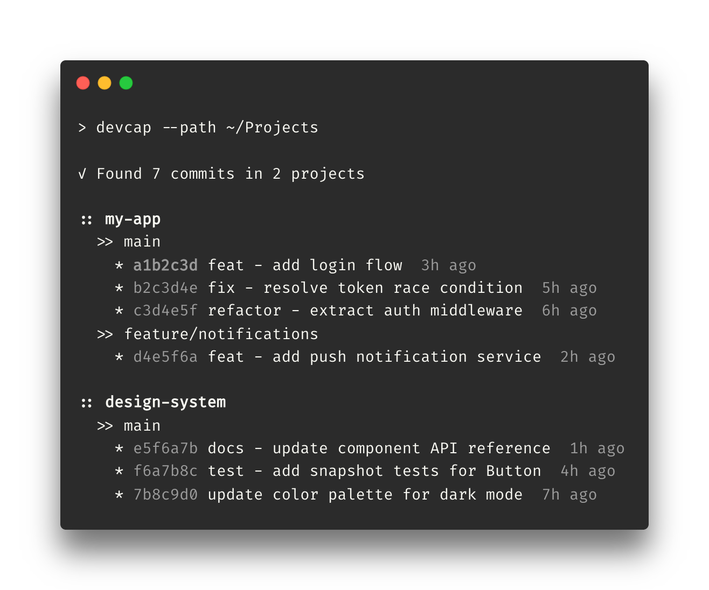

<p align="center">
  <picture>
    <source media="(prefers-color-scheme: dark)" srcset="docs/images/devcap-cli-logo-dark.svg">
    <source media="(prefers-color-scheme: light)" srcset="docs/images/devcap-cli-logo.svg">
    
  </picture>
</p>

<p align="center">
  Aggregate git commits across multiple local repositories for daily stand-ups and time tracking.
</p>

> [!TIP]
> Looking for a native Mac experience? Check out [devcap-app](https://github.com/konradmichalik/devcap-app) — a macOS Menu Bar app built on the same core.

Scans a directory tree for git repos in parallel, filters commits by author and time period, and renders a colorized `Project -> Branch -> Commits` tree — or structured JSON.



## ✨ Features

- **Flexible time periods** — `today`, `yesterday`, `week`, or arbitrary `Xh` / `Xd` (e.g. `24h`, `3d`, `14d`)
- **Parallel repo scanning** — uses [rayon](https://github.com/rayon-rs/rayon); skips `node_modules`, `target`, `vendor`, and other build artifacts automatically
- **Conventional commit highlighting** — color-coded by type, auto-detected for TTY
- **Interactive mode** — drill-down navigation through projects, branches, and commits with fuzzy search
- **Output depth** — show only projects, projects with branches, or full detail with `-d`
- **JSON output** — machine-readable, suitable for scripting or further processing
- **Clipboard copy** — `--copy` puts a clean plain-text summary on the clipboard for pasting into Slack or Teams
- **Config file** — `~/.devcap.toml` stores your defaults so you don't have to repeat `--path` and `--author`

> [!NOTE]
> Requires `git` on `$PATH`. Author defaults to `git config --global user.name`.

## 🔥 Installation

### Homebrew (macOS)

```bash
brew install konradmichalik/tap/devcap
```

This installs both `devcap` and the shorthand `wg`.

To update to the latest version:

```bash
brew upgrade konradmichalik/tap/devcap
```

### As a library

Use [`devcap-core`](core/) to build your own tools on top of the commit aggregation engine:

```toml
[dependencies]
devcap-core = "0.3"
```

### From source

```bash
cargo install --path .
```

## 🚀 Quick Start

```bash
# Today's commits in the current directory
devcap

# Yesterday across all projects under ~/Sites
devcap -p yesterday --path ~/Sites

# Last 7 days, filtered by author
devcap -p 7d --path ~/Sites -a "Jane Doe"

# This calendar week as JSON
devcap -p week --json

# Interactive drill-down mode
devcap -i --path ~/Sites -p 7d

# Compact overview — projects only
devcap -d projects --path ~/Sites -p 7d

# Projects with branches (no individual commits)
devcap -d branches --path ~/Sites -p 7d

# Show repository origin (GitHub, GitLab, etc.)
devcap --show-origin --path ~/Sites -p 7d

# Copy output to clipboard for stand-ups
devcap --copy --path ~/Sites -p yesterday

# Sort by number of commits (most active first)
devcap --sort commits --path ~/Sites -p 7d

# Sort alphabetically
devcap --sort name --path ~/Sites -p 7d
```

### Interactive Mode

Use `-i` / `--interactive` to browse results interactively instead of printing them all at once. Navigate through three levels with fuzzy search:

1. **Projects** — select a repository to inspect
2. **Branches** — select a branch within that project
3. **Commits** — select a commit to view its `git show --stat` details

Each level shows a summary with commit counts and last activity time. Navigation:

- **Type** to fuzzy-filter the list
- **Enter** to select an item
- **Esc** to go back one level (or quit at the top)
- **Show all** renders the familiar terminal tree output for the current scope

### Output Depth

Use `-d` / `--depth` to control how much detail is shown. Each level includes a summary with last activity time.

| Depth | Output |
|-------|--------|
| `projects` | `:: my-app  (6 commits, 2 branches, 2h ago)` |
| `branches` | Projects + `>> main  (4 commits, 2h ago)` |
| `commits` | Full tree with all commits (default) |

### Repository Origin

Use `-o` / `--show-origin` to display the hosting platform of each repository, detected from the `origin` remote URL:

```
:: my-app [GitHub]  (6 commits, 2 branches, 2h ago)
:: internal-tool [GitLab Self-Hosted]  (1 commit, 1 branch, 3d ago)
:: local-only  (2 commits, 1 branch, 5h ago)
```

Supported platforms: GitHub, GitLab, Bitbucket, GitLab Self-Hosted, and custom hostnames. The `origin` field is always included in JSON output regardless of the flag.

### Clipboard Copy

Use `--copy` to put a clean plain-text summary on the system clipboard — ready to paste into Slack, Teams, or a daily standup note:

```bash
devcap --copy -p yesterday --path ~/Sites
```

The normal terminal output is still printed; the clipboard content is a plain-text version without ANSI colors. A confirmation message (`Copied to clipboard.`) appears on stderr.

### Sorting

Use `--sort` to control the order of projects. The format is `<field>` or `<field>:<direction>`.

| Field | Default direction | Description |
|-------|-------------------|-------------|
| `time` | desc | Most recent commit first (default) |
| `commits` | desc | Most commits first |
| `name` | asc | Alphabetical by project name |
| `lines` | desc | Most changed lines first (requires `--stat`) |

```bash
devcap --sort name                # A → Z
devcap --sort name:desc           # Z → A
devcap --sort commits:asc         # least active first
devcap --sort lines --stat        # most changed lines first
```

### Config File

Create `~/.devcap.toml` to set defaults. CLI arguments always take precedence.

```toml
path = "~/Sites"
author = "Jane Doe"
period = "today"
show_origin = true
color = true
sort = "commits"
```

All fields are optional. When a field is not set in the config, the built-in default applies (`path = "."`, `period = "today"`, `sort = "time"`, color auto-detected from TTY).

### Options

```
Usage: devcap [OPTIONS]

Options:
  -p, --period <PERIOD>    Time period: today, yesterday, 24h, 3d, 7d, week [default: today]
      --path <PATH>        Root directory to scan for git repos [default: .]
      --json               Output as JSON instead of colored terminal tree
      --no-color           Disable colored output (overrides TTY auto-detection)
      --copy               Copy output to clipboard as plain text (for stand-ups)
  -i, --interactive        Interactive drill-down mode (projects > branches > commits)
  -d, --depth <DEPTH>      Output depth: projects, branches, commits [default: commits]
  -a, --author <AUTHOR>    Filter by author name (defaults to git config user.name)
  -o, --show-origin        Show repository origin (GitHub, GitLab, etc.)
  -s, --stat               Show diff stats (+insertions -deletions ~files) per commit
      --sort <SORT>        Sort projects: time, commits, name, lines (append :asc or :desc)
  -h, --help               Print help
  -V, --version            Print version
```

> [!NOTE]
> Colors are auto-detected: enabled when stdout is a terminal, disabled when piping. Use `--no-color` to force plain output, or set `color = false` in `~/.devcap.toml`.

> [!TIP]
> Use `--json` to pipe into `jq` for custom filtering:
> ```bash
> devcap -p week --json | jq '[.[] | {project, commits: [.branches[].commits[].message]}]'
> ```

### JSON Schema

Each entry in the JSON array follows this shape:

```json
{
  "project": "my-app",
  "path": "/Users/me/Sites/my-app",
  "origin": "github",
  "branches": [
    {
      "name": "main",
      "commits": [
        {
          "hash": "a1b2c3d",
          "message": "feat: add login flow",
          "commit_type": "feat",
          "timestamp": "2026-02-23T10:15:00+01:00",
          "relative_time": "3h ago"
        }
      ]
    }
  ]
}
```

> [!IMPORTANT]
> Merge commits are excluded from all output (`--no-merges` is always applied).

## 📜 License

MIT
